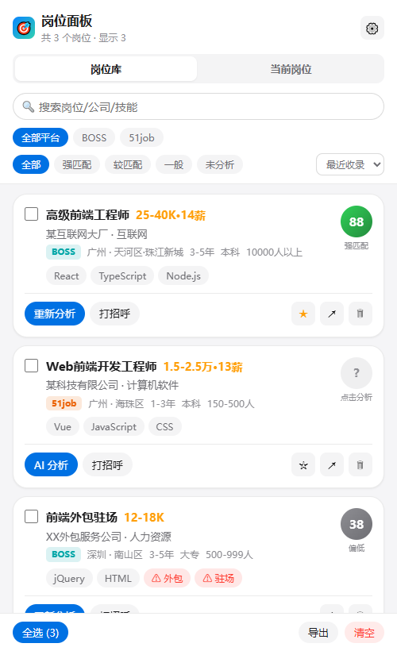
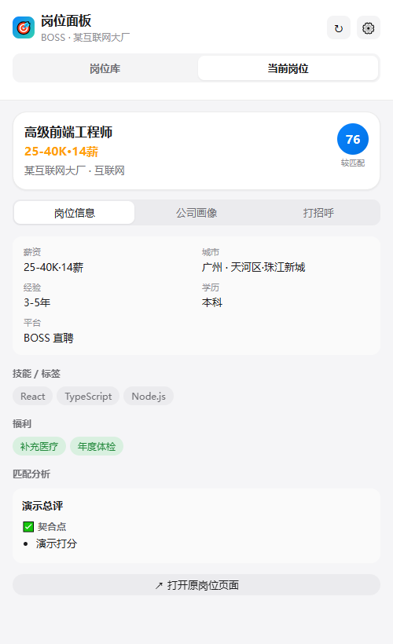
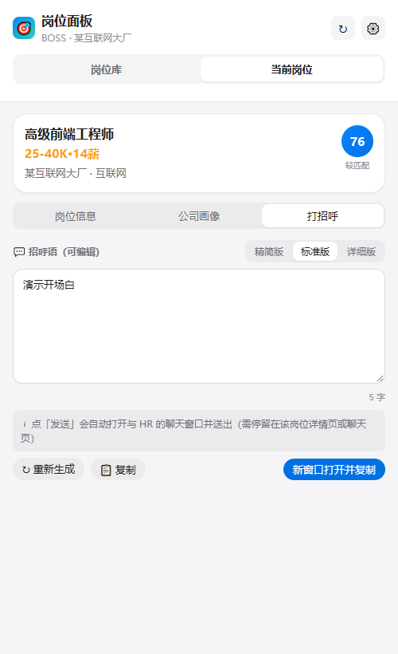
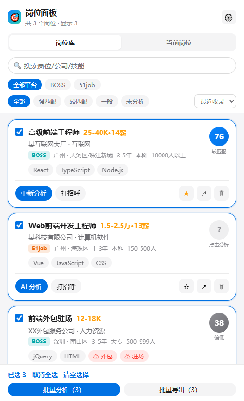
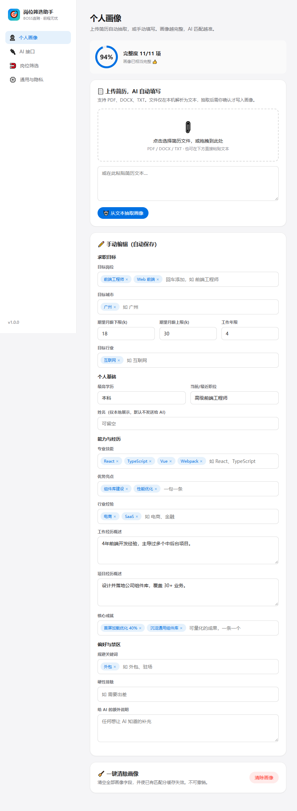

# 岗位筛选助手 · BOSS直聘 / 前程无忧

一个 Chrome 扩展（Manifest V3）：在你浏览 **BOSS直聘** 或 **前程无忧(51job)** 时被动收录岗位，
结合你的**个人画像**用 AI 做**逐岗位匹配分析**，并支持接入**任意兼容主流协议的 AI 接口**。

> 纯前端、零构建（原生 ES module）；所有数据只存在你自己的浏览器里，除了你主动配置的 AI 接口，不上传任何第三方。

参考了 `designer-boss-helper` 插件的交互思路，但做了通用化改造：双平台通用、职业不限、AI 供应商不锁定。

---

## 界面预览

### 岗位库
浏览时被动收录的岗位汇总。每张卡片带匹配档次色条、勾选框、收藏与「AI 分析」入口；顶部可搜索与切换平台视图。



### 当前岗位 · 岗位信息
浏览某个岗位详情时自动识别为「当前岗位」，展示归一化后的岗位信息、公司画像与技能标签。匹配分析除总评/契合点/差距/风险外，还会做**硬门槛识别**（醒目提示经验年限、学历、资深度等强制性不匹配）与**四维加权评分**（技能 / 经验 / 要求命中 / 城市）。



### 当前岗位 · 简历建议
基于你的画像与该岗位 JD，给出定制简历的具体建议：可突出的匹配点、建议对齐的关键词、如实指出的能力缺口、可直接粘贴的自我评价草稿、经历改写建议与投递提醒。**只给建议、不伪造经历，简历数据仅本会话使用、不落库。**

### 当前岗位 · 打招呼
AI 一次生成三档招呼语（精简 / 标准 / 详细），可直接编辑（自动存草稿）。一键复制，或「新窗口打开并复制」在不打断当前浏览的前提下打开岗位页。



### 批量选择与批量操作
勾选任意岗位后，底部工具栏切换为批量模式：**批量分析（仅对勾选项）** 与 **批量导出**（详细 CSV）。默认态提供「全选」快捷按钮。



### 设置页 · 个人画像 / AI 接口 / 本地筛选
上传简历自动抽取画像、配置任意兼容协议的 AI 供应商、设置不耗 token 的本地筛选规则。



---

## 核心功能

- **双平台通用**：BOSS直聘 与 前程无忧一套插件搞定；可「自动跟随当前站点」或锁定单平台视图。
- **被动抓取岗位**：在 MAIN world 劫持页面自身的 `fetch`/`XHR`，捕获岗位列表接口响应
  （BOSS `wapi/zpgeek/search/joblist.json`、51job `api/job/search-pc`）。**不逆向反爬令牌、不伪造签名**——
  让页面自己在真实登录态下把数据取回来，插件只读结果。接口未命中时有 DOM 兜底抓取。
- **个人画像**：上传简历（PDF / DOCX / TXT）→ AI 自动抽取结构化画像 → **你确认后再写入**；
  也可手动编辑。带完整度评分，随时**一键清除画像**。
- **AI 匹配分析**：基于画像对每个岗位打分（0–100 + 契合点 / 差距 / 风险 / 建议开场白），
  支持单个分析；**批量分析仅对勾选的岗位生效**，结果本地缓存（画像或模型变了才重算）。
- **当前岗位面板**：侧边栏顶部「岗位库 / 当前岗位」双模块。浏览某个岗位详情时自动识别为「当前岗位」并**实时跟随切换**，
  内含「岗位信息 / 公司画像 / 打招呼」三个子页。列表页点开详情抽屉（不改 URL）也能识别。
- **一键打招呼**：AI 一次生成三档招呼语（精简 / 标准 / 详细），可直接编辑（自动存草稿）；
  **复制** 到剪贴板，或 **新窗口打开并复制**——在**不打断你正在浏览的页面**的前提下，
  用一个不抢焦点的后台窗口打开岗位页，并已把招呼语复制好，你点「立即沟通」后 `Ctrl+V` 粘贴即可发送。
- **批量选择**：岗位库卡片可勾选，支持「全选 / 取消全选 / 清空选择」；勾选后底部工具栏切换为
  **批量分析（N）** 与 **批量导出（N）**。
- **批量导出**：把勾选岗位导出为分类齐全的 CSV（BOM + CRLF，Excel/WPS 直接打开），含平台 / 匹配 /
  岗位 / 薪资 / 公司 / AI 总评 / 招呼语 / 岗位描述 / 链接等分类列。
- **本地筛选**（不耗 token）：包含/排除关键词、风险词标注、城市、薪资、经验、学历、屏蔽公司。
- **多协议 AI 接入**：见下。
- **隐私**：发送给 AI 前默认脱敏（手机号/邮箱/联系方式/个人链接）；API Key 与全部数据仅存本机浏览器。

---

## 兼容的 AI 协议（不锁定单一供应商）

四大协议族，覆盖市面绝大多数厂商与本地模型：

| 协议 | 适配 |
|---|---|
| `openai-chat` | OpenAI `/chat/completions`——事实标准。DeepSeek、阿里百炼(兼容模式)、智谱GLM、Kimi、MiniMax、硅基流动、本地 Ollama/LM Studio/vLLM 等 |
| `openai-responses` | OpenAI 新版 `/responses` |
| `anthropic` | Anthropic `/v1/messages`（Claude），自动带 `anthropic-version` 头 |
| `gemini` | Google Gemini `generateContent`，key 走查询参数 |

内置预设一键创建（OpenAI / DeepSeek / 通义千问 / 智谱 / Kimi / 硅基流动 / Claude / Gemini / Ollama / 自定义）。
未列出的供应商，只要兼容上述任一协议，填自定义 `Base URL` 即可；还支持自定义请求 URL、模型列表 URL、额外请求头。

---

## 安装（加载未打包扩展）

1. Chrome 打开 `chrome://extensions/`
2. 右上角开启「开发者模式」
3. 点「加载已解压的扩展程序」，选择本项目根目录
4. 固定图标到工具栏。点击图标弹出快捷面板；面板里「打开岗位面板」进入侧边栏主界面。

首次使用：进入 **设置 → AI 接口** 添加一个供应商并填 Key/模型 → **设置 → 个人画像** 上传简历或手动填写。
之后正常浏览 BOSS/51job 的岗位列表，岗位会自动进入侧边栏，点「AI 分析」即可打分。

---

## 目录结构

```
manifest.json              扩展清单（MV3）
popup.html / sidepanel.html / options.html   三个页面入口
icons/                     图标（scripts/make_icons.py 生成）
src/
  common/                  共享逻辑（ES module，被 background 与 UI 复用）
    constants.js           存储键 / 消息协议 / 平台定义 / 默认设置
    platforms.js           BOSS / 51job 响应归一化（列表 + 详情，依真机逆向样本）
    profile.js             画像 schema / 完整度评分 / 清洗 / 合并
    filters.js             本地筛选规则
    jobsStore.js           岗位库读写 / 去重 / 淘汰 / 匹配缓存
    settingsStore.js       设置与供应商读写
    ai/
      providers.js         供应商预设 / 协议 / 校验
      client.js            多协议请求构造 + 响应解析 + 测试 + 列模型
      prompts.js           简历抽取 / 匹配打分提示词
      privacy.js           发送前脱敏
  background/background.js  Service Worker：消息路由 + 抓取收录 + AI 编排 + 窗口管理
  content/
    sniffer.js             MAIN world：劫持 fetch/XHR 捕获岗位接口
    collector.js           ISOLATED world：转发后台 + 上下文追踪 + DOM 兜底 + 角标
  ui/                       popup / sidepanel / options 的 JS/CSS + design.css 设计系统
  vendor/                   pdf.js（简历 PDF 解析）、fflate（DOCX 解压）
scripts/                   图标生成 + 纯逻辑测试
docs/screenshots/          README 截图
dev/                       本地预览用（mock chrome API），不进扩展包
```

---

## 开发与测试

```bash
# 纯逻辑单测（用真机逆向样本验证归一化/薪资/画像/筛选/AI 协议）
node scripts/test_logic.mjs

# 重新生成图标
python scripts/make_icons.py
```

UI 可视化预览（无需装扩展）：`dev/` 下有 mock 版页面，用 `python -m http.server` 起服务后访问
`/dev/sidepanel.html` 等即可在普通浏览器里走查界面。

---

## 说明与注意

- **权限**：`host_permissions` 含 `https://*/*`，用于让后台能向**你自己配置的任意 AI 接口**发请求
  （不同供应商域名不固定）。这会带来「读取所有网站数据」的安装提示，属功能所需；抓取仅在 BOSS/51job 生效。
- **关于「发送」**：经真机验证，两个平台都**不支持可靠的网页端自动发送**——BOSS 的聊天输入框被混淆无法定位、
  点「立即沟通」会跳转到独立聊天页；51job 网页端没有 BOSS 式的即时沟通聊天流。因此本插件的定位是
  **分析 + 招呼语生成 + 一键复制（手动粘贴发送）**，不承诺自动发送。
- **合规**：仅供个人求职辅助，被动读取你自己浏览时页面已加载的数据，不做高频批量爬取。请遵守各平台服务条款，控制使用频率。
- **数据**：API Key、画像、岗位库全部保存在浏览器 `chrome.storage.local`，不上传任何第三方（除你主动调用的 AI 接口）。
- 抓取依赖各平台当前接口结构（已按 2026-09 真机逆向样本适配）；平台改版后可能需更新 `src/common/platforms.js` 与 `src/content/sniffer.js` 的匹配规则。

---

## License

MIT
